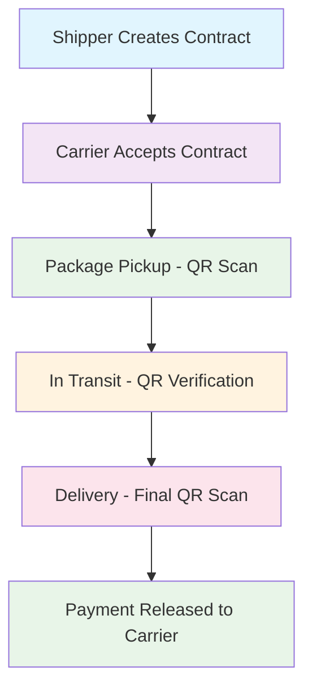

# 🚚 TrackFlow - Decentralized Logistics Coordination Platform

[](https://ethereum.org/)
[](https://soliditylang.org/)
[](https://nextjs.org/)
[](https://hardhat.org/)
[](https://openzeppelin.com/)

> **Revolutionizing logistics with blockchain technology** - TrackFlow enables secure, transparent, and automated logistics coordination through smart contracts, QR verification, and decentralized payments.


## 🌟 **What is TrackFlow?**

TrackFlow is a decentralized logistics coordination platform that brings transparency, security, and automation to supply chain management. Using blockchain technology, TrackFlow enables:

- **📦 Trustless Contract Creation**: Multi-party logistics agreements with automated enforcement
- **🔍 QR-Verified Milestones**: Physical milestone verification using QR codes
- **💰 Automated Payments**: Smart contract escrow with conditional releases
- **📊 Real-time Tracking**: Live contract status and progress monitoring
- **🔐 Decentralized Security**: No intermediaries, immutable records, cryptographic verification

## 🚀 **Key Features**

### **Core Functionality**
- ✅ **Smart Contract Logistics**: Multi-milestone contract creation with automated enforcement
- ✅ **QR Code Verification**: Cryptographically secure milestone verification
- ✅ **Automated Payments**: Conditional payment releases based on milestone completion
- ✅ **Real-time Tracking**: Live contract status and progress monitoring
- ✅ **Multi-party Coordination**: Support for shippers, carriers, and verifiers

### **Technical Features**
- 🔒 **Reentrancy Protection**: OpenZeppelin ReentrancyGuard implementation
- 🎯 **Access Control**: Role-based permissions for contract interactions
- 📱 **Responsive Design**: Mobile-first UI with Tailwind CSS
- 🌐 **Web3 Integration**: Seamless MetaMask wallet connection
- 🔧 **Local Development**: Complete Hardhat development environment
- 📊 **Progress Visualization**: Visual milestone completion tracking

### **Security Features**
- 🛡️ **Immutable Records**: All contract actions logged on blockchain
- 🔐 **Cryptographic Verification**: QR codes use contract-specific hashing
- 💰 **Escrow Protection**: Funds held securely until conditions met
- 🚫 **No Intermediaries**: Direct peer-to-peer transactions

## 🏗️ **Architecture Overview**

```
┌─────────────────┐    ┌──────────────────┐    ┌─────────────────┐
│   Frontend UI   │    │  Smart Contract  │    │   Blockchain    │
│                 │    │                  │    │                 │
│ • Next.js App   │◄──►│ • TrackFlow.sol  │◄──►│ • Ethereum      │
│ • React Components│   │ • Milestone Mgmt │    │ • Immutable     │
│ • Web3 Integration│   │ • Payment Logic  │    │ • Decentralized │
│ • QR Generation  │    │ • Access Control │    │ • Trustless     │
└─────────────────┘    └──────────────────┘    └─────────────────┘
         │                       │                       │
         └───────────────────────┼───────────────────────┘
                                 │
                    ┌────────────┴────────────┐
                    │    Workflow States      │
                    │                         │
                    │ • CREATED → ACCEPTED    │
                    │ • IN_TRANSIT → DELIVERED│
                    │ • DISPUTED (if issues)  │
                    └─────────────────────────┘
```

## 🛠️ **Tech Stack**

### **Frontend Layer**
- **Framework**: Next.js 15.4+ (App Router, Turbopack)
- **UI Library**: React 19 with TypeScript
- **Styling**: Tailwind CSS v4 with custom design system
- **Web3**: Ethers.js v6 for blockchain interaction
- **QR Codes**: QRCode.js for milestone verification

### **Blockchain Layer**
- **Language**: Solidity ^0.8.20
- **Framework**: Hardhat 2.26+ for development & testing
- **Security**: OpenZeppelin Contracts v5.4+
- **Network**: Ethereum-compatible (Localhost, Sepolia, Mainnet)

### **Development Tools**
- **Testing**: Hardhat test framework with Chai matchers
- **Type Safety**: TypeChain for TypeScript bindings
- **Code Quality**: ESLint, Prettier
- **Version Control**: Git with GitHub

## 📦 Installation & Setup

### Prerequisites
- Node.js 18+ (preferably 20+)
- MetaMask browser extension
- Git

### 1. Clone and Install Dependencies

```bash
# Install root dependencies
npm install

# Install Hardhat dependencies
cd contracts
npm install
cd ..
```

### 2. Start Local Blockchain

```bash
# Terminal 1: Start Hardhat node
cd contracts
npm run node
```

### 3. Deploy Contract

```bash
# Terminal 2: Deploy to localhost
cd contracts
npm run deploy:localhost
```

### 4. Start Frontend

```bash
# Terminal 3: Start Next.js app
npm run dev
```

Visit [http://localhost:3000](http://localhost:3000)

## 🔧 Usage

### 1. Connect Wallet
- Click "Connect MetaMask"
- Switch to "Hardhat Localhost" network (Chain ID: 31337)
- If needed, MetaMask will auto-add the network

### 2. Create Contract
- Fill in carrier and recipient addresses
- Set payment amount in ETH
- Add milestones with locations and verifiers
- Submit to create contract

### 3. Accept Contract (Carrier)
- View contracts in the dashboard
- Click "Accept Contract" as the designated carrier

### 4. Verify Milestones
- Use the Milestone Verification section
- Enter contract ID
- Generate QR codes for each milestone
- Verify milestones (simulated scanning)

## 🧪 Testing

Run the integration test:

```bash
# From project root
node test-integration.js
```

This will:
- Create a contract with 3 milestones
- Accept the contract
- Verify all milestones
- Release payment automatically

## 📁 **Project Structure**

```
trackflow/
├── 📁 components/                 # React Components
│   ├── WalletConnectButton.tsx    # MetaMask wallet connection
│   ├── CreateContractForm.tsx     # Contract creation interface
│   ├── ContractDashboard.tsx      # Contract overview & management
│   └── MilestoneVerification.tsx  # QR code generation & verification
├── 📁 contracts/                  # Smart Contract Development
│   ├── contracts/
│   │   └── TrackFlow.sol          # Main logistics contract
│   ├── scripts/
│   │   └── deploy.ts              # Deployment automation
│   ├── test/                      # Contract tests
│   ├── hardhat.config.ts          # Hardhat configuration
│   └── package.json               # Contract dependencies
├── 📁 lib/                        # Utility Libraries
│   ├── contracts.ts               # Web3 integration utilities
│   └── TrackFlow.json             # Contract ABI & interfaces
├── 📁 src/app/                    # Next.js Application
│   ├── globals.css                # Global styles
│   ├── layout.tsx                 # Root layout
│   ├── page.tsx                   # Main application page
│   └── favicon.ico                # App favicon
├── 📁 public/                     # Static Assets
├── 📄 package.json                # Frontend dependencies
├── 📄 tsconfig.json               # TypeScript configuration
├── 📄 next.config.ts              # Next.js configuration
├── 📄 tailwind.config.js          # Tailwind CSS config
└── 📄 README.md                   # This documentation
```

## 🔧 **Smart Contract API**

### **Core Functions**

#### **createContract**
```solidity
function createContract(
    address carrier,
    address recipient,
    string[] calldata locations,
    address[] calldata verifiers
) external payable returns (uint256 contractId)
```
Creates a new logistics contract with specified milestones.

**Parameters:**
- `carrier`: Address of the transportation carrier
- `recipient`: Address of the package recipient
- `locations`: Array of milestone location names
- `verifiers`: Array of addresses authorized to verify each milestone

**Returns:** Unique contract ID

#### **acceptContract**
```solidity
function acceptContract(uint256 contractId) external
```
Carrier accepts the logistics contract and commits to delivery.

#### **verifyMilestone**
```solidity
function verifyMilestone(
    uint256 contractId,
    uint256 milestoneIndex,
    bytes calldata qrData
) external
```
Verifies a milestone using QR code data.

### **View Functions**

#### **getContract**
```solidity
function getContract(uint256 contractId) external view returns (
    address shipper,
    address carrier,
    address recipient,
    uint256 payment,
    Status status,
    uint256 totalMilestones,
    uint256 completedMilestones
)
```

#### **getMilestone**
```solidity
function getMilestone(uint256 contractId, uint256 milestoneIndex)
external view returns (string memory location, address verifier, bool completed)
```

### **Contract Events**

```solidity
event ContractCreated(
    uint256 indexed contractId,
    address indexed shipper,
    address carrier,
    address recipient,
    uint256 payment
);

event ContractAccepted(uint256 indexed contractId, address indexed carrier);

event MilestoneVerified(
    uint256 indexed contractId,
    uint256 milestoneIndex,
    string location,
    address verifier
);

event PaymentReleased(
    uint256 indexed contractId,
    address indexed carrier,
    uint256 amount
);
```

## 🔄 **Workflow & Use Cases**

### **📋 Complete Logistics Workflow**



### **🎯 Real-World Use Cases**

#### **E-commerce Shipping**
```
Customer → Shipper → Carrier → Delivery Point
    ↓         ↓         ↓         ↓
   Order   Contract  Transport  Complete
                    Payment
```

#### **International Freight**
```
Exporter → Freight Forwarder → Customs → Importer
    ↓            ↓            ↓         ↓
 Contract    Transport    Clear    Receive
                          Payment
```

#### **Supply Chain Tracking**
```
Manufacturer → Distributor → Retailer → Consumer
      ↓            ↓           ↓         ↓
   Produce      Ship       Stock    Purchase
                          Payment
```

### **📊 Contract States**

| State | Description | Actions Available |
|-------|-------------|-------------------|
| **CREATED** | Contract initialized, awaiting carrier | Accept Contract |
| **ACCEPTED** | Carrier committed, ready for transport | Verify Milestones |
| **IN_TRANSIT** | Package in transit, milestones being verified | Continue Verification |
| **DELIVERED** | All milestones completed, payment released | Contract Complete |
| **DISPUTED** | Issues encountered, manual intervention needed | Resolve Dispute |

### **🔐 Security Model**

- **Cryptographic Verification**: QR codes use `keccak256(contractId + location + verifier)`
- **Access Control**: Only authorized verifiers can confirm milestones
- **Payment Security**: Funds locked in escrow until conditions met
- **Immutable Audit Trail**: All actions permanently recorded on blockchain

## 🔐 Contract Security

- **ReentrancyGuard**: Prevents reentrancy attacks
- **Access Control**: Only authorized verifiers can confirm milestones
- **Payment Protection**: Funds held securely until completion
- **Event Logging**: All actions are logged on-chain

## 🌐 Network Configuration

### Hardhat Localhost
- **RPC URL**: `http://127.0.0.1:8545`
- **Chain ID**: `31337`
- **Currency**: ETH
- **Block Time**: Instant

### Pre-funded Accounts
The Hardhat node provides 20 accounts with 10,000 ETH each for testing.

## 🚀 **Deployment Guide**

### **Local Development Setup**
```bash
# 1. Install dependencies
npm install
cd contracts && npm install

# 2. Start local blockchain
cd contracts && npm run node

# 3. Deploy contract (in new terminal)
cd contracts && npm run deploy:localhost

# 4. Start frontend
npm run dev
```

### **Testnet Deployment**
```bash
# 1. Configure network in hardhat.config.ts
# Add your RPC URL and private key
networks: {
  sepolia: {
    url: "https://sepolia.infura.io/v3/YOUR_PROJECT_ID",
    accounts: ["0x" + process.env.PRIVATE_KEY]
  }
}

# 2. Deploy to testnet
cd contracts && npm run deploy:sepolia

# 3. Update contract address in lib/contracts.ts
# 4. Build for production
npm run build
```

### **Production Deployment**
```bash
# 1. Configure mainnet in hardhat.config.ts
# 2. Verify contract on Etherscan
# 3. Update environment variables
# 4. Deploy and verify
npx hardhat run scripts/deploy.ts --network mainnet
npx hardhat verify --network mainnet CONTRACT_ADDRESS
```

### **Environment Variables**
```bash
# .env.local
NEXT_PUBLIC_CONTRACT_ADDRESS=0x...
PRIVATE_KEY=your_private_key_without_0x
INFURA_PROJECT_ID=your_infura_id
ETHERSCAN_API_KEY=your_etherscan_key
```

## 🤝 **Contributing**

We welcome contributions to TrackFlow! Here's how you can help:

### **Development Workflow**
```bash
# 1. Fork the repository
# 2. Clone your fork
git clone https://github.com/your-username/trackflow.git
cd trackflow

# 3. Create a feature branch
git checkout -b feature/amazing-feature

# 4. Install dependencies
npm install
cd contracts && npm install

# 5. Make your changes
# - Follow existing code style
# - Add tests for new features
# - Update documentation

# 6. Test your changes
npm run dev                    # Frontend
cd contracts && npm run node   # Local blockchain
node test-integration.js       # Integration tests

# 7. Commit and push
git add .
git commit -m "Add amazing feature"
git push origin feature/amazing-feature

# 8. Create a Pull Request
```

### **Contribution Guidelines**
- 🔧 **Code Style**: Follow TypeScript and Solidity best practices
- 📝 **Documentation**: Update README for new features
- 🧪 **Testing**: Add tests for all new functionality
- 🔒 **Security**: Follow blockchain security best practices
- 📱 **UI/UX**: Ensure responsive design and accessibility

### **Areas for Contribution**
- 🚛 **Multi-modal Transport**: Support for air, sea, rail logistics
- 🌍 **Multi-chain Support**: Deploy to Polygon, Arbitrum, Optimism
- 📊 **Analytics Dashboard**: Advanced reporting and analytics
- 🤖 **Oracle Integration**: Real-world data feeds for verification
- 📱 **Mobile App**: React Native mobile companion app
- 🌐 **Multi-language**: Internationalization support

## 📄 License

MIT License - see LICENSE file for details.

## 🆘 Troubleshooting

### Common Issues

**"hardhat command not found"**
```bash
# Use npx or install globally
npx hardhat node
# or
npm install -g hardhat
```

**"Port 8545 already in use"**
```bash
# Kill existing process or use different port
npx hardhat node --port 8555
```

**"MetaMask can't connect to localhost"**
- Ensure Hardhat node is running
- Check MetaMask network configuration
- Try refreshing the page

**"Contract deployment failed"**
- Verify Hardhat node is running
- Check account balances
- Ensure correct network configuration

## 🙏 **Acknowledgments**

- **OpenZeppelin**: For providing battle-tested smart contract libraries
- **Hardhat**: For the excellent Ethereum development environment
- **Next.js**: For the powerful React framework
- **Ethers.js**: For seamless blockchain interaction
- **Tailwind CSS**: For the beautiful utility-first CSS framework

## 📞 **Support & Community**

- 📧 **Email**: For business inquiries and partnerships
- 💬 **Discussions**: GitHub Discussions for community support
- 🐛 **Issues**: GitHub Issues for bug reports and feature requests
- 📖 **Documentation**: Comprehensive docs and API reference

## 🎯 **Roadmap**

### **Phase 1 (Current)** ✅
- ✅ Core logistics contract with milestone verification
- ✅ Web3 frontend with MetaMask integration
- ✅ QR code generation and verification
- ✅ Automated payment releases

### **Phase 2 (Upcoming)**
- 🚧 Multi-chain deployment (Polygon, Arbitrum)
- 🚧 Advanced analytics and reporting
- 🚧 Mobile application development
- 🚧 Oracle integration for real-time data

### **Phase 3 (Future)**
- 🚧 AI-powered route optimization
- 🚧 IoT device integration
- 🚧 Cross-border regulatory compliance
- 🚧 Enterprise-grade security audit

---

## 🎉 **Ready to Transform Logistics?**

TrackFlow is more than just software—it's a complete solution for transparent, secure, and efficient logistics coordination. Whether you're a small business or a global enterprise, TrackFlow provides the tools you need to revolutionize your supply chain operations.

**Join us in building the future of logistics! 🚀**

---

<div align="center">
  <p><strong>Built with ❤️ using cutting-edge Web3 technologies</strong></p>
  <p>
    <a href="#trackflow---decentralized-logistics-coordination-platform">Back to Top</a> •
    <a href="https://github.com/your-username/trackflow/issues">Report Issues</a> •
    <a href="https://github.com/your-username/trackflow/discussions">Discussions</a>
  </p>
</div>
